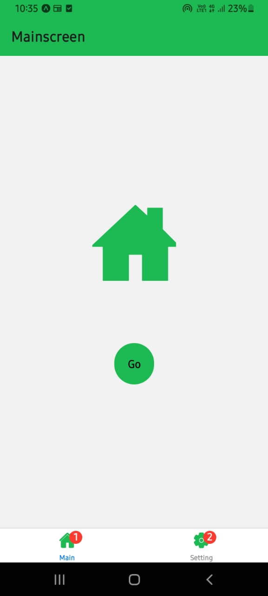
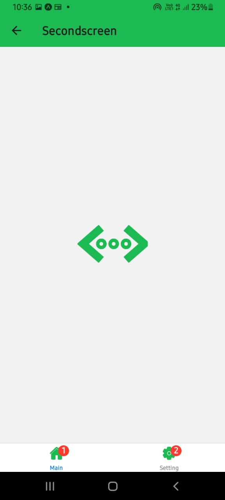
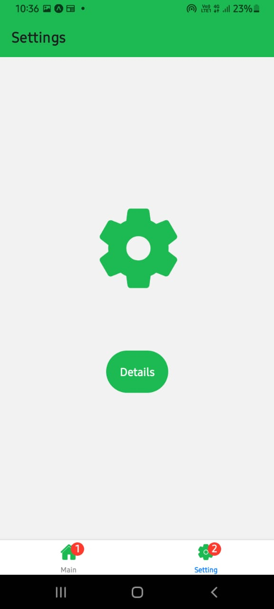
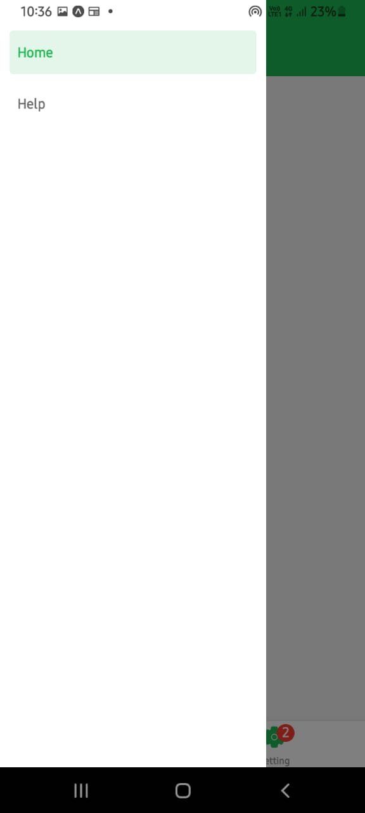
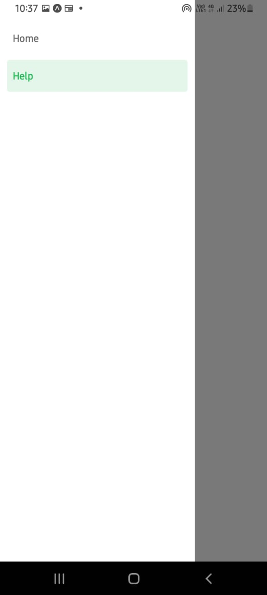

# <h1 align='center'> React Native Nested Navigations

This app was made in React-Native to show how nested navigations work. Here I have combined 3 types of navigations avilable in React-Native:-

* Stack naviagtion
* Tab Navigation
* Drawer Navigation
 
 
  
## Images and Working

 
The first images is the 'Main screen', ie, it is the screen that comes up when the app is opened, clicking on the 'Go' button moves it into the 'Second Screen'
 
 

 
On the bottom of the screen, you can see the 'Tab' Navigation bar which allows us to switch to the 'Settings' section of the app. Clicking on it shows the settings screen and further clicking on the 'Details' buttons, shows the datails screen.
 
 

 
Finally, swiping right in any of the screens show the drawer navigation, which has 2 options, Home and Help, clicking on help shows the help page.

